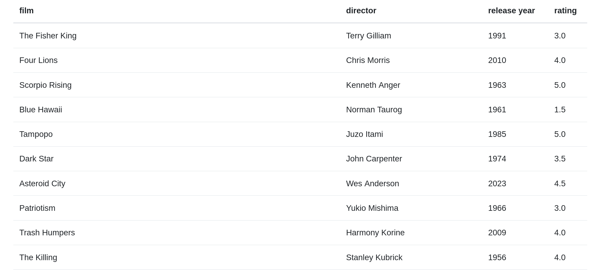

# csv-movie-db

Renders a csv file of movie ratings.

### How to run:
- Set up an apache server that can run php, and have it load `index.php`.
- Create a `movies.csv` file in the directory for the script to read. An `movies.csv` template has been provided, but you can use any headers you want; the script will dynamically load any csv file based on its table headers.
    - A script called `write_csv.py` has been provided that will write columns for you using the columns in `movies.csv`. Run like this: `python write_csv.py movies.csv`. 

### Uses:
* Datatables
* Bootstrap
* Wikimedia Foundation (browser icon)

### TODO:
* AJAX to add/remove/edit table entries
* [Use API to fetch movie posters](https://www.omdbapi.com)
