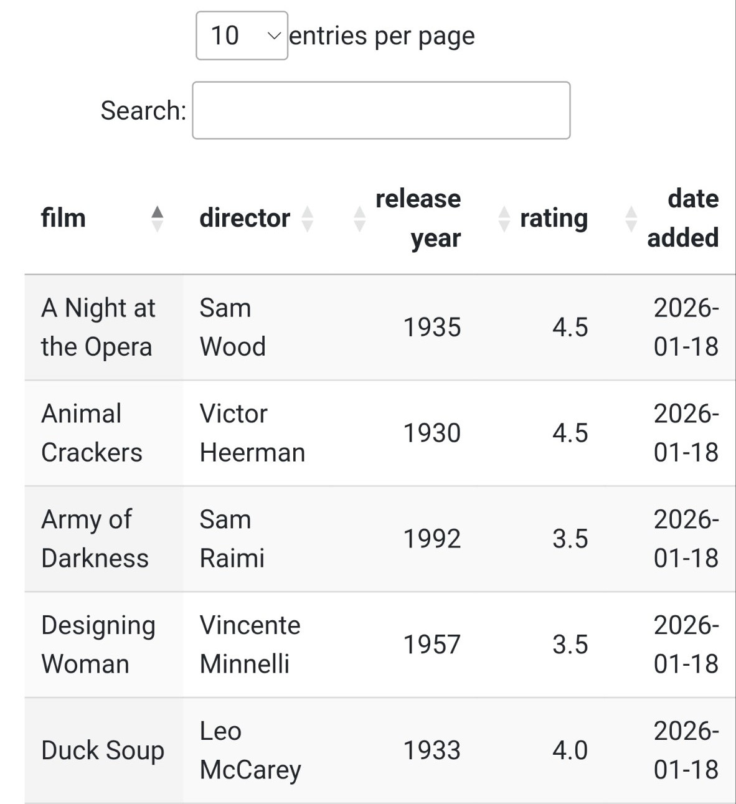

# csv-movie-db
Renders a csv file of movie ratings. See a live example [here](https://laikahaskell.dev/movies/).

### How to run:
- `csv-movie-db.php`, when loaded, will read `movies.csv` and render it into a table, ready for [Datatables](https://datatables.net/). 
    - A sample `index.html` has been provided, which the user can customize. It uses Datatables to display the content loaded by the script.
- Create a `movies.csv` file in the directory for the script to read. An `movies.csv` template has been provided, but you can use any headers you want; the script will dynamically load ANY csv file based on its table headers.
    - A script called `write_csv.py` has been provided that will write columns for you to a default standard. Supply the desired .csv as the second argument, otherwise it will simply print the comma separated values to stdout.

### Uses:
* Datatables
* Bootstrap
* Wikimedia Foundation (browser icon)

### TODO:
* AJAX to add/remove/edit table entries
* [Use API to fetch movie posters](https://www.omdbapi.com)
